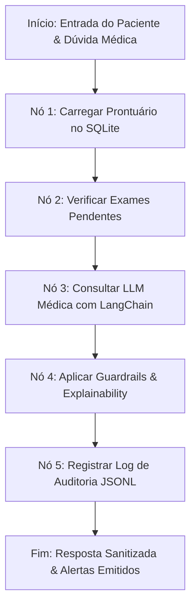

# Relatório Técnico - Fase 3: Assistente Virtual Médico com LangChain, LangGraph e Fine-Tuning

## 1. Visão Geral do Projeto

A Fase 3 do Tech Challenge expande a automação hospitalar para a criação de um **Assistente Virtual Médico** alimentado por dados próprios do hospital. O sistema atua como apoio à decisão clínica, respondendo a dúvidas de médicos, sugerindo procedimentos embasados em diretrizes internas, consultando prontuários estruturados em banco de dados e coordenando fluxos de decisão seguros com **LangChain** e **LangGraph**.

---

## 2. Fine-Tuning e Customização do Modelo LLM

### 2.1. Curadoria e Anonimização de Dados Médicos (PII Removal)
Para garantir a privacidade dos pacientes e conformidade com a LGPD e normativas de saúde, foi implementado o módulo `fase3/dataset_prep.py`. Este módulo aplica técnicas de expressão regular (Regex) e sanitização NLP para remover:
- **CPF / Identificadores**: Substituídos pelo token `[CPF_ANONIMIZADO]`.
- **Nomes de Pacientes e Médicos**: Substituídos pelo token `[NOME_ANONIMIZADO]`.
- **Datas de Atendimento**: Substituídas por `[DATA_ANONIMIZADA]`.
- **Contatos e Telefones**: Substituídos por `[TELEFONE_ANONIMIZADO]`.

### 2.2. Construção do Dataset Sintético
Com base na estrutura de repositórios clínicos públicos como **PubMedQA** e **MedQuAD**, foi estruturado o dataset `data/medical_protocols.json` contendo:
- Protocolos de Triagem e Emergência (ex.: Dor Torácica Aguda, Sepse e Ressuscitação Volêmica).
- Modelos de Laudos e Diretrizes de Imagem (ex.: Radiografia de Tórax e Consolidação Pneumônica).
- FAQs e Guias de Farmácia Clínica (ex.: Interações Medicamentosas de Warfarina e AINEs).
- Protocolos de Manejo Glicêmico e Endocrinologia.

### 2.3. Formatação e Artefatos de Fine-Tuning
O módulo `fase3/fine_tuning.py` gera dois artefatos principais para treinamento/customização:
1. **`fine_tuning_artifacts/medical_ft_openai.jsonl`**: Dataset no formato de mensagens de instrução (`system`, `user`, `assistant`), pronto para Fine-Tuning via API OpenAI / ChatML.
2. **`fine_tuning_artifacts/Modelfile.medical`**: Arquivo de definição para modelos locais via Ollama (ex.: LLaMA-3 / Qwen), incluindo System Prompt especializado, parâmetros de inferência clínica (`temperature=0.2`) e stop tokens.

---

## 3. Arquitetura do Assistente Médico com LangChain e SQLite

O assistente foi modularizado em componentes desacoplados:

1. **`fase3/database.py`**: Banco de dados relacional SQLite (`data/patient_db.sqlite`) contendo tabelas de `pacientes`, `prontuarios` (queixas, sinais vitais, medicamentos, alergias) e `exames` (com status `PENDENTE` ou `CONCLUIDO`).
2. **`fase3/app_gui.py`**: Interface gráfica web desenvolvida em **Streamlit**, permitindo navegação interativa entre prontuários, alertas de exames pendentes, simulações clínicas no LangGraph, auditoria em tempo real e visualização de artefatos de fine-tuning.
3. **`fase3/assistente_medico.py`**: Pipeline construído com **LangChain** (`MedicalAssistantChain`). O pipeline recupera o protocolo institucional correspondente via palavras-chave/RAG, injeta o contexto dinâmico do prontuário do paciente e constrói um prompt estruturado garantindo **Explainability** (citação explícita da fonte do protocolo).

---

## 4. Orquestração do Fluxo de Decisão com LangGraph

A coordenação dos estados clínicos e checagens automáticas foi implementada no módulo `fase3/langgraph_workflow.py` através do **LangGraph**.

### 4.1. Diagrama do Fluxo (Mermaid)

### 4.2. Descrição dos Nós do Grafo
- **`carregar_prontuario`**: Recupera dados cadastrais, histórico de internação e última evolução clínica do paciente no SQLite.
- **`verificar_exames_pendentes`**: Identifica se há exames fundamentais ainda não laudados (ex.: Troponina, Lactato) e emite alertas visíveis caso existam pendências.
- **`gerar_conduta_llm`**: Invoca o LangChain injetando o contexto do paciente e a diretriz do protocolo hospitalar.
- **`aplicar_guardrails`**: Intercepta a resposta para converter eventuais prescrições autônomas diretas em sugestões recomendadas ao médico, anexa a citação da fonte do protocolo e inclui o aviso legal obrigatório.
- **`registrar_auditoria`**: Grava os dados da sessão em arquivo `outputs/audit_log.jsonl`.

---

## 5. Segurança, Guardrails e Audit Logging

### 5.1. Limites de Atuação e Guardrails (`fase3/guardrails.py`)
- **Bloqueio de Prescrição Autônoma**: O assistente é impedido de realizar prescrições diretas e definitivas de medicamentos. Frases com teor prescritivo são convertidas automaticamente para recomendações subordinadas à validação médica.
- **Disclaimer Clínico Obrigatório**: Todas as respostas contêm um aviso legal ressaltando a indispensabilidade da validação humana por médico com registro profissional (CRM).
- **Explainability**: Toda conduta gerada traz a indicação clara do protocolo ou diretriz institucional consultada.

### 5.2. Audit Logging Estruturado (`fase3/audit_logger.py`)
Cada interação gera um evento em `outputs/audit_log.jsonl` com:
- `timestamp` da requisição.
- `paciente_id` e identificação do usuário.
- `exames_pendentes_detectados`.
- `protocolo_consultado`.
- `validacao_seguranca` (status de aprovação e bloqueios).
- `alertas_emitidos`.

---

## 6. Avaliação e Análise dos Resultados

A validação foi realizada executando o script `fase3/run_demo.py` em múltiplos cenários clínicos:

### 6.1. Resultado no Caso 1 (Cardiologia - Dor Torácica Aguda)
- **Paciente**: PAC-101 (58 anos, masculino, leito 204-A).
- **Exames Pendentes Detectados**: Troponina I Quantitativa (1ª Amostra) e Ecocardiograma Transtorácico.
- **Resultado do Assistente**: Identificou com precisão o protocolo de dor torácica, recomendou monitorização e ECG em 10 min, emitiu alerta sobre a Troponina pendente, citou a fonte (*Protocolo Interno Hospitalar - Cardiologia v2024*) e aplicou o disclaimer de segurança.

### 6.2. Resultado no Caso 2 (Infectologia/UTI - Suspeita de Sepse)
- **Paciente**: PAC-202 (67 anos, feminino, UTI Leito 03).
- **Exames Pendentes Detectados**: Lactato Arterial de Controle.
- **Resultado do Assistente**: Selecionou o protocolo de Sepse 3.0, sugeriu conduta com ressuscitação volêmica (30 mL/kg de cristaloide) e hemoculturas, alertou sobre o lactato pendente, citou a fonte (*Protocolo Hospitalar de Infectologia & UTI - Sepse 3.0*) e gravou a sessão no audit log.

### 6.3. Conclusão
O sistema atendeu integralmente a todos os requisitos obrigatórios da Fase 3 do Tech Challenge, demonstrando modularidade, segurança operacional, orquestração robusta com LangGraph/LangChain e total rastreabilidade.
